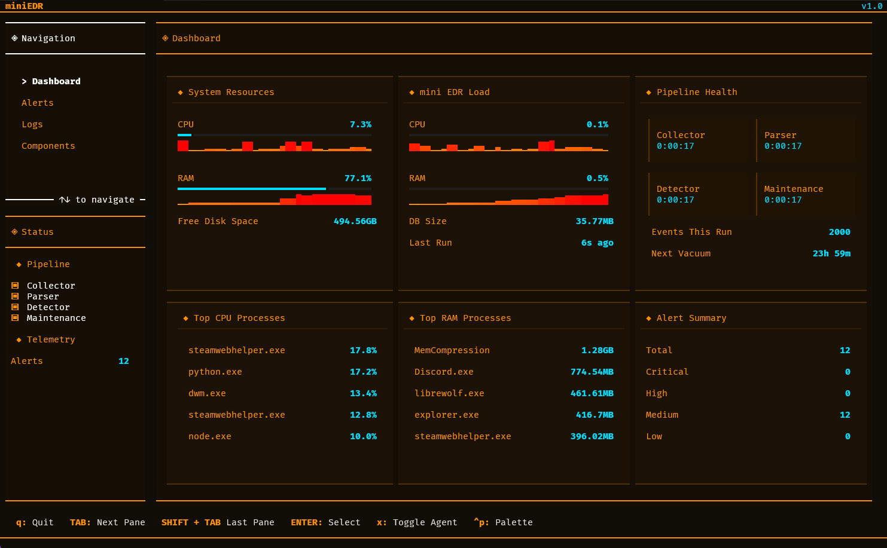

## miniEDR
A lightweight, terminal based Endpoint Detection & Response agent for Windows, built on top of Sysmon. It collects Sysmon events, parses them into a local SQLite database, runs detection rules mapped to MITRE ATT&CK, and displays everything through a live terminal dashboard.



## Requirements
 
- Windows (Sysmon must be installed and running)
- Python 3.11+
- Administrator privileges (required to read the Sysmon event log)
- Dependencies:

```
 pip install textual rich psutil pywin32
```

## Running
Run as administrator:
```
python main.py
```
This launches a terminal user interface.
All pipeline components start disabled until enabled in the Components pane or by pressing `x` to toggle all of them at once.
Quit with `q`. The agent thread is given a few seconds to shut down cleanly before the program exits.

## Interface
miniEDR runs as a [Textual](https://textual.textualize.io/) terminal UI with four panes navigable from the sidebar:

| Pane | Contents |
|---|---|
|**Dashboard**| Live system & agent resource usage (CPU/RAM with sparkline history), free disk space, database size, top CPU/RAM processes, component uptime, events processed this run, time until next vacuum, and an alert summary by severity|
|**Alerts**| A table of fired alerts (ID, Rule, Severity, MITRE, Timestamp) with a detail pane showing the full parsed event and the paths of the alert log files |
|**Logs**| A live scrolling feed of the agent's internal operational log (All Component's status and errors)|
|**Components**| Shows the enabled/disabled status of each pipeline component with a description, lets you toggle them individually|
## How It Works
The agent runs in a continuous loop (every 15 seconds) and moves events through a pipeline: 
```
Sysmon Event Log
      │
      ▼
  Collector        Reads new Sysmon events via the Windows Event Log API
      │             and writes them as JSONL files to agent/spool/inbox/
      ▼
   Parser          Moves files from inbox → processing, parses the XML,
      │             and inserts records into the SQLite database
      ▼
  Detector         Runs detection rules against the parsed records
      │             and writes any alerts to the database and log files
      ▼
  Maintenance      Runs every 24 hours to purge old records from the
                   database and clean up old spool files
```
Each component can be enabled or disabled independently from the **Components** pane.
## Spool Directories
 
| Directory | Purpose |
|---|---|
| `agent/spool/inbox/` | New files written by the collector, waiting to be parsed |
| `agent/spool/processing/` | Files actively being parsed (allows crash recovery) |
| `agent/spool/done/` | Successfully parsed files, kept for forensic review (purged after 7 days)|
| `agent/spool/bad/` | Files that failed to parse, kept for troubleshooting (purged after 30 days)|

# Detection Rules
### Process Events (Sysmon Event ID 1)
 
| Rule | MITRE | Description |
|---|---|---|
| `powershell_encoded_command` | T1059.001 | PowerShell launched with a Base64-encoded command |
| `powershell_defender_exclusion` | T1562.001 | PowerShell adding Windows Defender exclusions |
| `powershell_disable_defender_av` | T1562.001 | Attempts to stop or disable Windows Defender |

### Network Events (Sysmon Event ID 3)
 
| Rule | MITRE | Description |
|---|---|---|
| `network_notepad_connection` | T1055 | Notepad initiating an outbound network connection |
| `network_crypto_connection` | T1496 | Connection to a known crypto mining pool |
| `network_ngrok_domain_connection` | T1567, T1572, T1102 | Connection to an ngrok domain |
| `network_ngrok_tunnel_communication` | T1567, T1568.002, T1572, T1090, T1102, S0508 | Connection to an ngrok tunnel endpoint |

# Alerts
 
Alerts are written to two places:
 
- `logs/Alerts.log` — human-readable format
- `logs/Alerts.jsonl` — one JSON object per line, suitable for ingestion into other tools
  
  Example log entry:
```
----------------------------------------

Rule name: powershell_encoded_command | Severity: medium | MITRE: T1059.001
Message: Powershell launched with an encoded command. Possible obfuscation or defence evasion.
Event:
  User:                   Computer/User
  Parent Image:           C:\Windows\System32\WindowsPowerShell\v1.0\powershell.exe
  Image:                  C:\Windows\System32\WindowsPowerShell\v1.0\powershell.exe
  Parent Command Line:    "C:\Windows\System32\WindowsPowerShell\v1.0\powershell.exe" 
  Command Line:           "C:\Windows\System32\WindowsPowerShell\v1.0\powershell.exe" -enc <base64>
  Integrity Level:        Medium
  Hashes:                 MD5=<MD5 HASH>,SHA256=<SHA256>,IMPHASH=<IMPHASH>

----------------------------------------
```
## Database
 
Events and alerts are stored in a SQLite database at `db/edr.db`.
 
| Table | Contents |
|---|---|
| `process_create` | Parsed Sysmon Event ID 1 records |
| `network_connect` | Parsed Sysmon Event ID 3 records |
| `alerts` | Fired detection alerts |
| `state` | Collector checkpoints (last seen Event Record ID per event type) |
 
The schema is initialised automatically on first run. Records older than 30 days are purged during daily maintenance.
